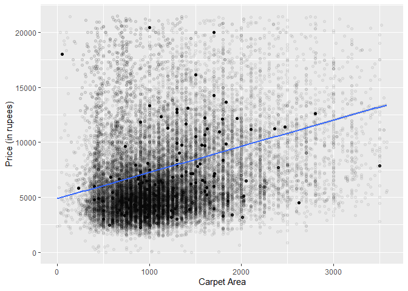

    library(readr)
    library(dplyr)

    ## 
    ## Attaching package: 'dplyr'

    ## The following objects are masked from 'package:stats':
    ## 
    ##     filter, lag

    ## The following objects are masked from 'package:base':
    ## 
    ##     intersect, setdiff, setequal, union

    house_prices <- read_csv("house_prices.csv")

    ## Rows: 173384 Columns: 21

    ## ── Column specification ────────────────────────────────────────────────────────
    ## Delimiter: ","
    ## chr (15): Title, Description, Amount(in rupees), location, Carpet Area, Stat...
    ## dbl  (4): Index, Price (in rupees), Bathroom, Balcony
    ## lgl  (2): Dimensions, Plot Area
    ## 
    ## ℹ Use `spec()` to retrieve the full column specification for this data.
    ## ℹ Specify the column types or set `show_col_types = FALSE` to quiet this message.

    #Remove NA values

    house_prices <- filter(house_prices, !is.na(`Carpet Area`), !is.na(`Price (in rupees)` )) 

    conversion_factors <- c(
      sqft = 1,
      sqm = 10.7639,
      sqyrd = 9,
      acre = 43560,
      ground = 2400,
      bigha = 27000,  # assuming the size of a bigha as used in some regions
      marla = 272.25,
      kanal = 5445
    )

    # Our column is characters with differing units, so we must convert it to numerics.
    convert_to_sqft <- function(area_string) {
     
      parts <- strsplit(area_string, " ")[[1]]
      value <- as.numeric(parts[1])
      unit <- parts[2]
      
      value_in_sqft <- value * conversion_factors[[unit]]
      return(value_in_sqft)
    }

    house_prices$`Carpet Area` <- sapply(house_prices$`Carpet Area`, convert_to_sqft)

    head(house_prices)

    ## # A tibble: 6 × 21
    ##   Index Title       Description `Amount(in rupees)` `Price (in rupees)` location
    ##   <dbl> <chr>       <chr>       <chr>                             <dbl> <chr>   
    ## 1     0 1 BHK Read… Bhiwandi, … 42 Lac                             6000 thane   
    ## 2     1 2 BHK Read… One can fi… 98 Lac                            13799 thane   
    ## 3     2 2 BHK Read… Up for imm… 1.40 Cr                           17500 thane   
    ## 4     4 2 BHK Read… This lovel… 1.60 Cr                           18824 thane   
    ## 5     6 1 BHK Read… This magni… 16.5 Lac                           2538 thane   
    ## 6     9 3 BHK Read… One can fi… 1.60 Cr                           11150 thane   
    ## # ℹ 15 more variables: `Carpet Area` <dbl>, Status <chr>, Floor <chr>,
    ## #   Transaction <chr>, Furnishing <chr>, facing <chr>, overlooking <chr>,
    ## #   Society <chr>, Bathroom <dbl>, Balcony <dbl>, `Car Parking` <chr>,
    ## #   Ownership <chr>, `Super Area` <chr>, Dimensions <lgl>, `Plot Area` <lgl>

We need to remove some of our outliers which may skew the data

    library(ggplot2)
    price_ceil <- quantile(house_prices$`Price (in rupees)`, 0.98)
    area_ceil <- quantile(house_prices$`Carpet Area`,0.98)

    house_prices_no_outliers <- filter(house_prices, `Price (in rupees)` < price_ceil, `Carpet Area` < area_ceil)

Perform the regression

    model <- lm(`Price (in rupees)` ~ `Carpet Area`, data = house_prices_no_outliers)
    summary(model)

    ## 
    ## Call:
    ## lm(formula = `Price (in rupees)` ~ `Carpet Area`, data = house_prices_no_outliers)
    ## 
    ## Residuals:
    ##    Min     1Q Median     3Q    Max 
    ## -10428  -2478  -1027   1667  16229 
    ## 
    ## Coefficients:
    ##                Estimate Std. Error t value Pr(>|t|)    
    ## (Intercept)   4.866e+03  3.198e+01  152.17   <2e-16 ***
    ## `Carpet Area` 2.383e+00  2.509e-02   94.98   <2e-16 ***
    ## ---
    ## Signif. codes:  0 '***' 0.001 '**' 0.01 '*' 0.05 '.' 0.1 ' ' 1
    ## 
    ## Residual standard error: 3719 on 82292 degrees of freedom
    ## Multiple R-squared:  0.09879,    Adjusted R-squared:  0.09878 
    ## F-statistic:  9021 on 1 and 82292 DF,  p-value: < 2.2e-16

Our R-squared is low, so a linear regression is not a good fit for our
data.

\#Visualization

    ggplot(data = house_prices_no_outliers) + 
      geom_point(mapping = aes(x = `Carpet Area`, y = `Price (in rupees)`), alpha = 0.05) + # we set a low alpha (transparency) for easier visualization
      geom_smooth(method = "lm", mapping = aes(x = `Carpet Area`, y = `Price (in rupees)`))

    ## `geom_smooth()` using formula = 'y ~ x'

