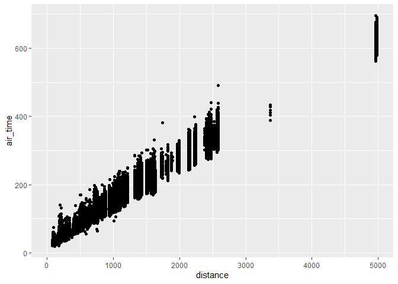
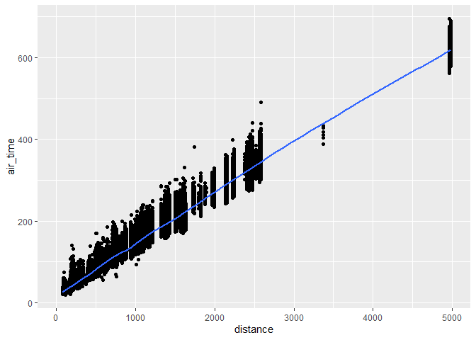
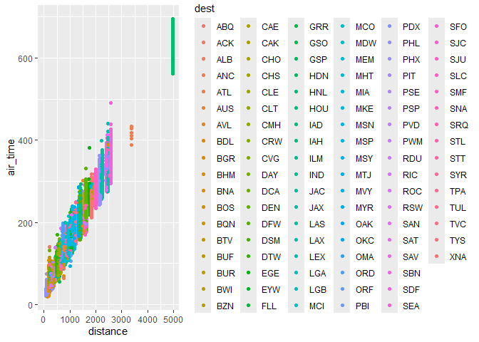
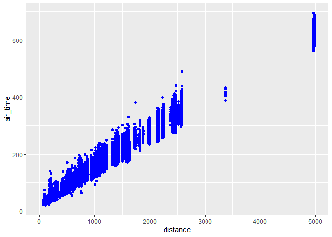
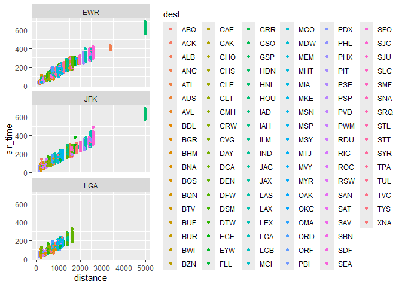
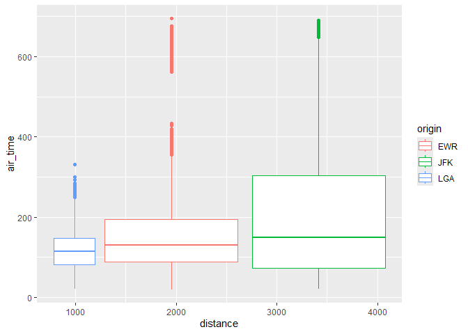
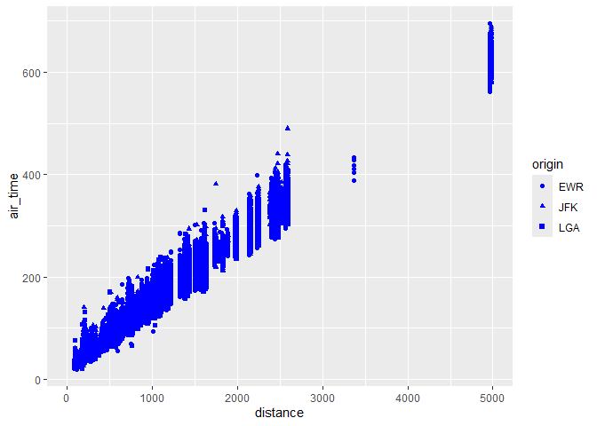
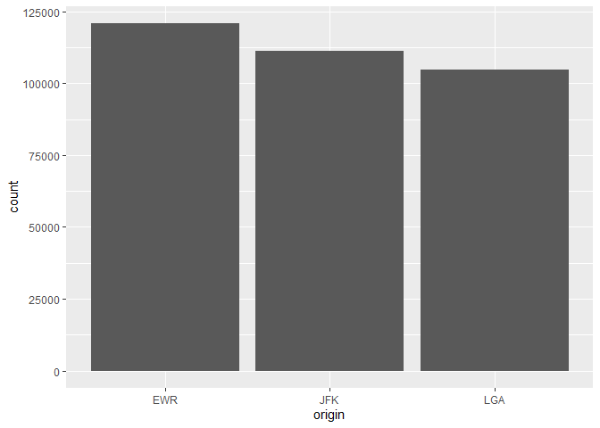

# Data Visualization

There are many ways to visualize data in R. This tutorial will teach you
about ggplot2, which is one of the most commonly used libraries for
visualization. Let’s use the flights dataset again.

    if (!requireNamespace("ggplot2", quietly = TRUE)) { # checks if the package is in the namespace.
        install.packages("ggplot2")
    }
    library("ggplot2")

    if (!requireNamespace("nycflights13", quietly = TRUE)) { # checks if the package is in the namespace.
        install.packages("nycflights13")
    }
    library("nycflights13")

    head(flights)

    ## # A tibble: 6 × 19
    ##    year month   day dep_time sched_dep_time dep_delay arr_time sched_arr_time
    ##   <int> <int> <int>    <int>          <int>     <dbl>    <int>          <int>
    ## 1  2013     1     1      517            515         2      830            819
    ## 2  2013     1     1      533            529         4      850            830
    ## 3  2013     1     1      542            540         2      923            850
    ## 4  2013     1     1      544            545        -1     1004           1022
    ## 5  2013     1     1      554            600        -6      812            837
    ## 6  2013     1     1      554            558        -4      740            728
    ## # ℹ 11 more variables: arr_delay <dbl>, carrier <chr>, flight <int>,
    ## #   tailnum <chr>, origin <chr>, dest <chr>, air_time <dbl>, distance <dbl>,
    ## #   hour <dbl>, minute <dbl>, time_hour <dttm>

In order to create a ggplot, we start off with an empty ggplot before
adding graphs to that canvas

    ggplot(data = flights) +
      geom_point(mapping = aes(x = distance, y = air_time))

    ## Warning: Removed 9430 rows containing missing values or values outside the scale range
    ## (`geom_point()`).

Essentially, whenever we create a ggplot we need to create a coordinate
system from the data through ggplot. Then we can add layers to our
ggplot through functions like geom\_point or geom\_line.

    ggplot(data = flights) +
      geom_point(mapping = aes(x = distance, y = air_time)) +
      geom_smooth(mapping = aes(x = distance, y = air_time))

    ## `geom_smooth()` using method = 'gam' and formula = 'y ~ s(x, bs = "cs")'

    ## Warning: Removed 9430 rows containing non-finite outside the scale range
    ## (`stat_smooth()`).

    ## Warning: Removed 9430 rows containing missing values or values outside the scale range
    ## (`geom_point()`).

# Aesthetic Mappings

Notice how in each of our geom functions we have a parameter of mapping
taking in an object of class aes. The aesthetic class controls how our
graph looks based off of the data we provide to it.

    ggplot(data = flights) +
      geom_point(mapping = aes(x = distance, y = air_time, color = dest))

    ## Warning: Removed 9430 rows containing missing values or values outside the scale range
    ## (`geom_point()`).

By mapping the color to a variable, we can see more clearly that most of
the flights with same/similar distances come from the same area.

We can also declare the color of a ggplot outside of the aesthetic if
you simply want to change the color of the graph unconditionally.

    ggplot(data = flights) +
      geom_point(mapping = aes(x = distance, y = air_time), color = "blue")

    ## Warning: Removed 9430 rows containing missing values or values outside the scale range
    ## (`geom_point()`).

\# Facet

We can add facets to ggplot. Facets are subplots in our data, which
display a subset of our data.

In order to facet your plot by a single variable, use facet\_wrap(). The
first argument of facet\_wrap() should be a formula (created with ~)
followed by the variable name. The variable in facet\_wrap() you provide
MUST be discrete.

    ggplot(data = flights) +
      geom_point(mapping = aes(x = distance, y = air_time,color = dest)) +
      facet_wrap(~origin, nrow = 3)

    ## Warning: Removed 9430 rows containing missing values or values outside the scale range
    ## (`geom_point()`).

\# Types of Geoms

Geoms, short for Geometric Object, control what kind of visual object is
used to represent the data. For example, bar charts use bar geoms, line
charts use line geoms and so on (scatter plots use the point geom). Data
can be described with different geoms to represent them.

    ggplot(data = flights) +
      geom_boxplot(mapping = aes(x = distance, y = air_time,color = origin))

    ## Warning: Removed 9430 rows containing non-finite outside the scale range
    ## (`stat_boxplot()`).

Here we use a box and whiskers plot instead of a scatter plot to convey
our data.

Every geom function in ggplot2 takes a mapping argument. However, not
every aesthetic works with every geom. For example, you can set the
shape of a point with the shape parameter in the aesthetic.

    ggplot(data = flights) +
      geom_point(mapping = aes(x = distance, y = air_time, shape = origin), color = "blue")

However, setting the shape of a line will return an error because line
does not take shape as a valid parameter for its aesthetics.

\#Statistical Transformations

One of the most comonly used graph is a bar graph. Bar graphs can be
made with the geom\_bar()

    ggplot(data = flights) +
      geom_bar(mapping = aes(x = origin))

Notice how the Y axis is count, which is derived from information in our
data.
